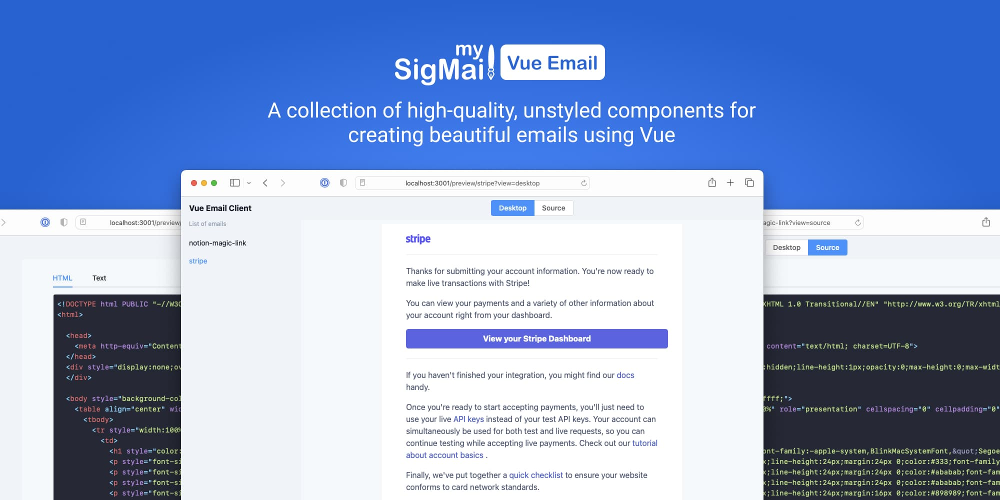

<h1 align="center">MySigMail Vue Email Components</h1>

A collection of high-quality, unstyled components for creating beautiful emails using Vue.

## Introduction

Reduces the difficulty of coding responsive emails, easing the challenges of development and ensuring consistency across various email clients, such as Gmail, Outlook, and others.

## Motivation

Email still remains one of the most widely used and popular communication channels to this day, and its popularity shows no signs of diminishing over time.

We aim to simplify the process of creating emails and make it more accessible for everyone.

## Components

This is a collection of pre-built components that can be used to create impressive emails without the hassle of manually creating tables and managing outdated code.

- [Body](https://github.com/mysigmail/vue-email/tree/main/packages/components/body)
- [Button](https://github.com/mysigmail/vue-email/tree/main/packages/components/button)
- [Column](https://github.com/mysigmail/vue-email/tree/main/packages/components/column)
- [Container](https://github.com/mysigmail/vue-email/tree/main/packages/components/container)
- [Divider](https://github.com/mysigmail/vue-email/tree/main/packages/components/hr)
- [Head](https://github.com/mysigmail/vue-email/tree/main/packages/components/head)
- [Heading](https://github.com/mysigmail/vue-email/tree/main/packages/components/heading)
- [Html](https://github.com/mysigmail/vue-email/tree/main/packages/components/html)
- [Image](https://github.com/mysigmail/vue-email/tree/main/packages/components/img)
- [Link](https://github.com/mysigmail/vue-email/tree/main/packages/components/link)
- [Paragraph](https://github.com/mysigmail/vue-email/tree/main/packages/components/text)
- [Preview](https://github.com/mysigmail/vue-email/tree/main/packages/components/preview)
- [Section](https://github.com/mysigmail/vue-email/tree/main/packages/components/section)

## Client

This repository contains a client application that serves as a local testing environment. Using this client, you can create email templates by selecting from pre-built components, apply styles to these components, preview the final render, and obtain the corresponding  HTML code.
This repository contains a client application that serves as a local testing environment. Using this platform, you can create email templates by selecting from pre-built components, apply styles to these components, preview the final render, and obtain the corresponding  HTML code.

## Other

Inspired by [react-email](https://github.com/resendlabs/react-email)

## License

MIT

Copyright (c) 2023-present, [Anton Reshetov](https://github.com/antonreshetov).